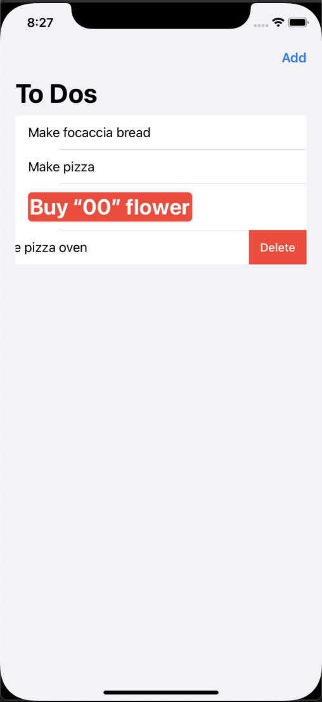

# Welcome to my first SwiftUI app
I coded this up from a PluralSight tutorial entitled *"Build Your First SwiftUI App in Under 90mins"* by [Nick Walter](https://app.pluralsight.com/profile/author/nick-walter).  

## it looks like this

## Patterns
Some of the principles and patterns followed in this repo are:
* Views in SwiftUI
* Lists and Navigation Views
* Controls
* Data Flow
* State Persistence 

## Thoughts
I have to admit that it's not easy to get going in Swift because of the various versions and patterns that have changed the look and feel quite a bit over the years. But, I hope this repo helps you get start as I'm trying to now. 

